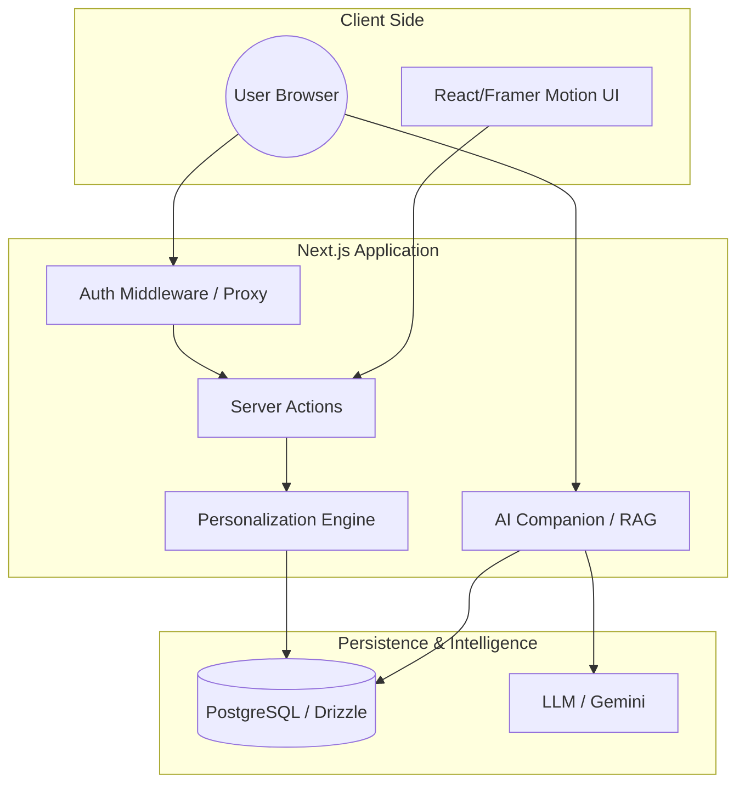

# System Architecture

## Overview
The application is built on **Next.js 15** using the App Router. It follows a server-centric architecture where state persistence is handled by a PostgreSQL database managed via Drizzle ORM.

## High-Level Diagram

- **Frontend**: React Client Components with Framer Motion for animations.
- **Backend/API**: Next.js Server Actions and Route Handlers.
- **Database**: PostgreSQL (Neon/Supabase) with Drizzle ORM.
- **AI Layer**: Vercel AI SDK (OpenAI/Gemini) with RAG integration.

## Core Modules

### 1. Unified Authentication (`auth.ts`, `proxy.ts`)
We use **NextAuth.js** for authentication. A custom `proxy.ts` (middleware) handles route protection, ensuring that `/dashboard`, `/companion`, and `/docs` are only accessible to authenticated users.

### 2. Data Layer (`db/schema.ts`)
The schema is designed for personalization:
- **`users`**: Stores profile data including `role`, `seniority`, and a `skills` (jsonb) array.
- **`milestones`**: A catalog of role-foundation and tech-specific templates.
- **`userProgress`**: Tracks the completion of milestones for each specific user.
- **`documents`**: Stores the knowledge base content used for RAG and the `/docs` page.

### 3. Personalization Engine (`app/assessment/actions.ts`)
When a user completes the assessment:
1.  Their profile is updated in the `users` table.
2.  The engine queries `milestones` for:
    - Items where `roleTarget` matches the user's role OR is null (general).
    - Items where `skillTarget` matches any skill in the user's selected list.
3.  Initial `userProgress` records are created to populate the dashboard.

### 4. AI & RAG Pipeline (`app/api/chat/route.ts`)
The AI companion uses a Retrieval-Augmented Generation (RAG) pattern:
- **Keyword Extraction**: Parses user queries for key terms (e.g., "VPN", "Auth").
- **Document Retrieval**: Searches the `documents` table for matching content.
- **Contextual Response**: Feeds the relevant document snippets into the LLM prompt to provide accurate, project-specific answers.
